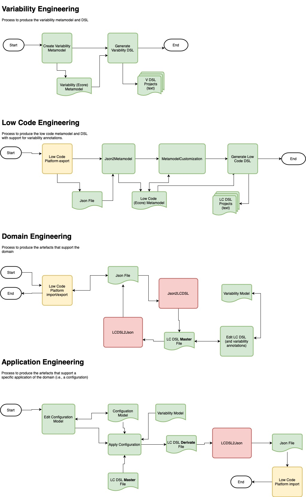

# Requirements

  OpenJDK 1.8
  
  Maven
  
## Notes

- In Maven, the **-o** option is used so that maven does not always fetch info from the repositories 
- We recommend that all the maven commands should be executed for the first time wothout the **-o** option, but the append the **-o** option to all maven commands so that the execution is fast 

# Attention

  When building inside Code or Gitpod be aware that sometimes these IDEs only work with java versions from 11! They can try to automatically build the sources!
  
# Projects

**1) pt.bamol.vmodel**
	
 * this is the project that contains the **variability metamodel** used in this example (emf project)
 * it does not depend on any other project
 * to build:
 
	mvn clean install  

**2) pt.bamol.vmodel.vmodeldsl**
	
 * this is the project that contains the **variability DSL** (xtext project). 
 * it depends on the vmodel project (for the variability metamodel)
 * to build (execute in the **parent**):
 
	mvn clean install  

**3) pt.bamol.json**
	
 * this is the project that contains the **json DSL** (xtext project). 
 * it does not depend on any other project
 * to build (execute in the **parent**):
 
	mvn clean install  
	
**4) pt.bamol.atl.json2ecore**
	
 * this is a project that contains **model transformations** (ATL project and also EMF project, since it produces ecore metamodels)
 * it depends on the projects: **json**; **vmodel**
 * to build:
 
	mvn clean install  
	
 * after building, execute the transformations
 * to execute the transformation that takes as input the json files of OMNIA and **produces a first metamodel of OMNIA** (bamol ecore):
 
	mvn exec:java@json2ecore
	
 * the resulting metamodel has the following identification:

	name <- 'bamolM',
	nsURI <- 'http://bamol.pt/bamolM',
	nsPrefix <- 'bamolM'
	
 * the process is able to produce a metamodel, but it is incomplete
 * a new **transformations (ecore Customization)** can be used to provide the missing information. For instance, this will also add references to the variability metamodel so that the elements of the generated Bamol metamodel can be annotated with variability information
 * to execute this new transformation use:
 
	mvn exec:java@ecoreCustomization
	
 * the resulting metamodel has the following identification:

	name <- 'bamolM2',
	nsURI <- 'http://bamol.pt/bamolM2',
	nsPrefix <- 'bamolM2'
 	 	
 * **NOTE:** this transformation produces an intermediate metamodel that is 'invalid'. This is not a problem, since this metamodel is only temporary, to support the process
 * the default resulting metamodel name is **bamol-ecore-customization.ecore**.
 * It is necessary to open this project in eclipse to generate a genmodel and then generate the code for this metamodel (at the moment this activity is not automated)
 
**5) pt.bamol.bamolm2** 	

 * this is a project that contains a **DSL based in the previous bamol metamodel** (xtext project)
 * this project can be generated by using the Eclipse wizard Xtext  "Xtext Project From Existing Ecore Models" and selecting the previous generated metamodel (do not forget to reference also the metamodel of **vmodel** to support the variability annotations)
 * this project will depend on the projects: **json2ecore**; **vmodel**
 * to build (execute in the **parent**):	
 
	mvn clean install  
	
**6) pt.bamol.atl.configuration** 

 * this is a project that contains a **model transformation** (ATL project) that generates instances of the Bamol DSL that are in accordance with configuration models
 * it depends on the projects: **bamolm2**; **vmodeldsl**; **vmodel**; **json2ecore**
 * to build:
 
	mvn clean install  
	
 * after building, execute the transformation
 
	mvn exec:java@config
	
 * this transformation takes as input: an instance of the bamol dsl (that can have variabillity annotations); an instance of the variability dsl that is referenced byt the previous bamol dsl; an instance of the variability dsl that functions as a configuration model (which contains only the selected features)
 * the output is the name of the resulting bamol dsl file	
 
# Overview of the Process 

	
