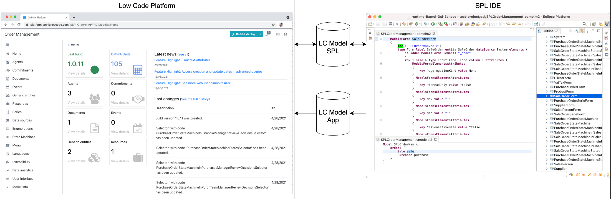
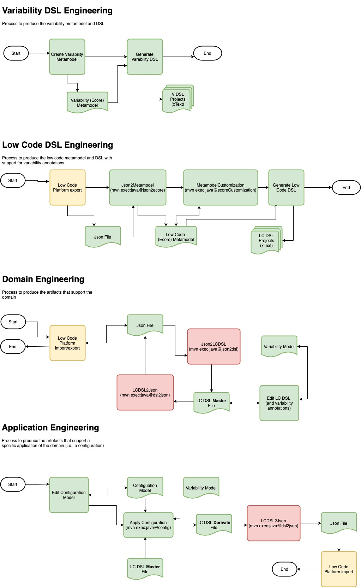

# Towards Supporting SPL Engineering in Low-Code Platforms using a DSL Approach

This repository contains all the resources and artifacts of the paper entitled **Towards Supporting SPL Engineering in Low-Code Platforms using a DSL Approach** submitted in the GPCE 2021 - 20th International Conference on Generative Programming: Concepts & Experiences by the authors Alexandre Bragança, Isabel Azevedo, Nuno Bettencourt, Carlos Morais, Diogo Teixeira, and David Caetano. 

**This corresponds to the case study presented and discussed in the paper.** The implementation is based on Eclipse, Xtext, Maven and ATL. 

The goal of this project is to explore supporting software product lines (SPL) in low code application platforms (LCAP) using domain-specific languages (DSL). 

The proposed solution is based on an integrated developmrnt environment (IDE) - that we call SPL IDE - that supports the development of the SPL in a way that is orthogonal to the LCAP. In fact, the only requirement is that the LCAP has some support for importing and exporting application models (e.g., using JSON files).
 
This project is a part/component of the BAMoL research project. *Project BAMoL Low-Code Platform and the consortium BAMoL – LCP, co-financed by Fundo Europeu de Desenvolvimento Regional (FEDER), Programa Operacional Competividade e Internacionalização and Portugal2020 (POCI-01-0247-FEDER-39661).*
 
Please refer to the paper **Towards Supporting SPL Engineering in Low-Code Platforms using a DSL Approach** for further details about the approach and solution.

*This repository contains only snapshot of the project.*

# Contacts

This project is developed by a team from the Institute of Engineering of Porto – Polytechnic of Porto (ISEP/IPP), Portugal.

For further information please contact:
 - Alexandre Braganca (ATB@isep.ipp.pt)
 - Isabel Azevedo (IFP@isep.ipp.pt)
 - Nuno Bettencourt (NMB@isep.ipp.pt)

# Requirements

  OpenJDK 1.8
  
  Maven

  Eclipse (tested with version 2021-03)    

## Notes

- In Maven, the **-o** option is used so that maven does not always fetch info from the repositories 
- We recommend that all the maven commands should be executed for the first time wothout the **-o** option, but after that, append the **-o** option to all maven commands so that the execution is faster 
  
# Projects and Usage

The repository contains several Eclipse/Maven projects. Projects from 1 to 6 are Eclipse plugins. Together they provide the functionality that *transforms* Eclipse into an SPL IDE.

Projects 1 to 6 can be build from a terminal or console using Maven. They also can be opened from Eclipse. 

Project 7 is a testing and demonstration project that should be used with an Eclipse instance that has all the plugins from projects 1 to 6 loaded and activated.

**1) pt.bamol.vmodel**
	
 * this is the project that contains the **variability metamodel** used in this example (emf project)
 * it does not depend on any other project
 * to build:
 
	mvn clean install  

**2) pt.bamol.vmodel.vmodeldsl**
	
 * this is the project that contains the **variability DSL** (xtext project). 
 * it depends on the vmodel project (for the variability metamodel)
 * to build (execute in the **parent**):
 
	mvn clean install  

**3) pt.bamol.json**
	
 * this is the project that contains the **json DSL** (xtext project). 
 * it does not depend on any other project
 * to build (execute in the **parent**):
 
	mvn clean install  
	
**4) pt.bamol.atl.json2ecore**
	
 * this is a project that contains **model transformations** (ATL project and also EMF project, since it produces ecore metamodels)
 * this project is used to generate (deduce) metamodels from models. It uses json model as input and produces ecore metamodel as ouput
 * it depends on the projects: **json**; **vmodel**
 * to build:
 
	mvn clean install  
	
 * after building, execute the transformations
 * to execute the transformation that takes as input the json files of OMNIA and **produces a first metamodel of OMNIA** (bamol ecore):
 
	mvn exec:java@json2ecore
	
 * the resulting metamodel has the following identification:

	name <- 'bamolM',
	nsURI <- 'http://bamol.pt/bamolM',
	nsPrefix <- 'bamolM'
	
 * the process is able to produce a metamodel, but it is incomplete
 * a new **transformations (ecore Customization)** can be used to provide the missing information. For instance, this will also add references to the variability metamodel so that the elements of the generated Bamol metamodel can be annotated with variability information
 * to execute this new transformation use:
 
	mvn exec:java@ecoreCustomization
	
 * the resulting metamodel has the following identification:

	name <- 'bamolM2',
	nsURI <- 'http://bamol.pt/bamolM2',
	nsPrefix <- 'bamolM2'
 	 	
 * **NOTE:** this transformation produces an intermediate metamodel that is 'invalid'. This is not a problem, since this metamodel is only temporary, to support the process
 * the default resulting metamodel name is **bamol-ecore-customization.ecore**.
 * It is necessary to open this project in eclipse to generate a genmodel and then generate the code for this metamodel (at the moment this activity is not automated)
 
**5) pt.bamol.bamolm2** 	

 * this is a project that contains a **DSL based in the previous bamol metamodel** (xtext project)
 * this project can be generated by using the Eclipse wizard Xtext  "Xtext Project From Existing Ecore Models" and selecting the previous generated metamodel (do not forget to reference also the metamodel of **vmodel** to support the variability annotations)
 * this project will depend on the projects: **json2ecore**; **vmodel**
 * to build (execute in the **parent**):	
 
	mvn clean install  

 * If the *pt.bamol.bamolm2* model already exists you may use the xtext wizard to generate a temporary dsl project based on the previous metamodel and copy the contents of the xtext generated file into this projet   
	
**6) pt.bamol.atl.configuration** 

 * this is a project that contains a **model transformation** (ATL project) that generates instances of the Bamol DSL that are in accordance with configuration models
 * it depends on the projects: **bamolm2**; **vmodeldsl**; **vmodel**; **json2ecore**
 * to build:
 
	mvn clean install  
	
 * after building, execute the transformation
 
	mvn exec:java@config
	
 * this transformation takes as input: an instance of the bamol dsl (that can have variabillity annotations); an instance of the variability dsl that is referenced byt the previous bamol dsl; an instance of the variability dsl that functions as a configuration model (which contains only the selected features)
 * the output is the name of the resulting bamol dsl file	

 * You may also use this project to convert between json and dsl formats 
 
**7) Test project**

 * This project can be used to test the overwall approach
 
 * You should open all the others projects in Eclipse and spawn a second instance of Eclipse were you use this project to test the approach

# Overview of the Process 

	
